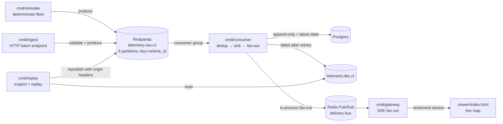

# event-stream-platform — Engineering Design

Status: **design committed before implementation**, as this project's Phase 1 requires. Nothing in
`cmd/` or `internal/` exists yet, and none of it will until this document and the ADRs beside it are
on disk.

---

## 0. Recon

### What already exists

`tenant-api-platform` (sibling repository, shipped and public) is a request/response service: tenants,
auth, invoices, idempotency, rate limiting, an audit log, and webhooks delivered through a Postgres
outbox. It deliberately has **no broker**.

This repository is the second half of a deliberate pair, and the boundary between them is drawn on
purpose:

| | `tenant-api-platform` | `event-stream-platform` (this) |
|---|---|---|
| Shape | request → response | stream → many consumers |
| Coupling | an event must commit with the row that caused it | events arrive continuously, independent of any write |
| Ordering | per-tenant, implied by transactions | per-entity, explicit and documented |
| Backpressure | the client waits; latency is the signal | consumers lag; the log is the buffer |
| Failure of interest | a webhook receiver is down | a consumer is slow, dead, or poisoned |

The outbox in the sibling repo exists because a broker client cannot join a Postgres transaction.
That constraint does not exist here: nothing commits an event alongside a business row, so a log is
free to be a log. **This is a different problem, not a reversal**, and ADR-001 states it in full
because a reviewer who sees "no broker" in one repository and "Redpanda" in the other deserves the
argument rather than the inconsistency.

### Domain

Telemetry from a **vehicle fleet on fixed routes** — position reports with speed, bearing, and a
per-vehicle sequence number.

Chosen over the alternatives for concrete reasons:

- It is the domain where the hard parts are *native*, not bolted on. A delayed GPS report is a real
  late event. A retransmitted report is a real duplicate. A vehicle that skips is a real ordering
  violation. Nothing has to be invented to make the problem interesting.
- The **fan-out is visual**: a live map updating over SSE is a demo a reviewer can watch, and it
  requires no explanation.
- The stream is naturally **partitionable by a real entity** (`vehicle_id`), so per-key ordering is a
  property of the domain rather than a contrivance.
- It is **not a sixth weather repository.** Five existing public repos already cover
  weather/rainfall (skyguard, floodlens, bustwatch, stormcast, weathergpt). A sixth would read as a
  rut.

**The stream is simulated from committed route geometry, and the README will say so in those words.**
It is not a live feed. See ADR-008 for why a deterministic source is the right call for a repository
that must run offline in CI, and what the adapter boundary for a real feed looks like.

### Environment (measurement context, stated once)

| Item | Value |
|---|---|
| Host | `i7-13620H`, 16 logical CPUs, Windows 11 |
| Container runtime | Docker Desktop, 12.3 GB allocated to the VM |
| Disk free | 132 GB |
| Go | 1.27.0 |
| Postgres | 16 (container) |
| Redis | 7 (container) |
| Redpanda | `rpk` v26.2.2 (container) |
| k6 | v2.2.0 |

### Broker feasibility — measured, not assumed

Before committing to Redpanda, it was run on this host and exercised end to end:

```
rpk cluster health           → Healthy: true
rpk topic create smoke-events -p 3 -r 1   → OK
produce 5 messages           → partitions 2, 2, 1, 0, 1  (key-hashed distribution confirmed)
consume from start           → 2|0|key1, 2|1|key2, 0|0|key4, 1|0|key3, 1|1|key5
resource cost while running  → 193 MB, 0.53% CPU
```

A three-partition topic with correct key hashing and offset-addressed consumption is the primitive
this design depends on, and it is confirmed working inside a 12.3 GB Docker VM that is already
running another project's Postgres and Redis. If that had failed, ADR-001's fallback would have been
taken instead.

---

## A. Requirements (functional)

| # | Requirement |
|---|---|
| FR-1 | Ingest accepts batches of telemetry events over HTTP, validates them, and publishes them to a partitioned log |
| FR-2 | Events carry a versioned envelope; a consumer must be able to process versions it was not built against |
| FR-3 | A consumer group processes the log concurrently, with the group's offsets managed by the broker |
| FR-4 | Processing is idempotent: re-delivery of an event must not produce a duplicate side effect |
| FR-5 | The consumer sinks events to Postgres — an append-only history plus a latest-state table per vehicle |
| FR-6 | Out-of-order and late events are handled by a stated rule, not left to chance |
| FR-7 | Events that fail processing are retried with backoff; exhausted events go to a dead-letter topic |
| FR-8 | An operator can list the dead-letter queue and replay entries, preserving original metadata |
| FR-9 | A gateway fans events out to browsers over SSE |
| FR-10 | A browser client that reconnects resumes from where it left off, not from the beginning |
| FR-11 | Slow consumers are shed rather than allowed to grow memory without bound |
| FR-12 | A deterministic simulator produces a realistic stream without any external API |
| FR-13 | Consumer lag and queue depth are exposed as Prometheus metrics |
| FR-14 | Both processes drain cleanly on SIGTERM: no partially-applied event, no lost offset |
| FR-15 | A live viewer renders vehicle positions on a map without refreshing the page |

## B. Requirements (non-functional)

Every target below is a **target**, not a claim. Each is measured in M7 and the README publishes what
was actually observed, with the methodology and the caveats beside it — including any target that was
missed.

| # | Target |
|---|---|
| NFR-1 | Ingest sustains ≥ 2,000 events/s on this host |
| NFR-2 | End-to-end p95 (publish → delivered to a subscriber) ≤ 500 ms |
| NFR-3 | ≥ 200 concurrent SSE clients on one gateway process, without unbounded memory growth |
| NFR-4 | A killed consumer loses no applied event and produces no duplicate side effect |
| NFR-5 | A restarted consumer resumes within 15 s |
| NFR-6 | Deduplication is exact within the retention window and the window is documented |
| NFR-7 | No secrets in the repository; every configuration value has a validated default or fails fast at boot |
| NFR-8 | `docker compose up` yields a working system including the viewer, with no external API calls |
| NFR-9 | The full suite runs against real Postgres, real Redis, and a real broker — not mocks |
| NFR-10 | No metric exists that nobody would query during an incident |

## C. Architecture



### Components and why each exists

| Component | Responsibility | Why it is separate |
|---|---|---|
| `cmd/ingest` | HTTP batch ingestion: validate, assign envelope, publish | It is the only process that accepts untrusted input, so it is the only one that needs rate limiting and request-size limits |
| `cmd/simulate` | Deterministic fleet producer | A producer is not a server. Mixing it into ingest would mean the demo path and the API path share a binary with different trust levels |
| `cmd/consumer` | Consumer group member: dedup, sink, publish for fan-out | Its scaling axis is partitions, not HTTP connections. It must be able to run 1..N copies with one command |
| `cmd/gateway` | SSE fan-out to browsers, `Last-Event-ID` resume | Its scaling axis is connected clients and it holds per-connection state. Putting SSE in the consumer would couple browser reconnects to partition assignment |
| `cmd/replay` | Inspect DLQ, replay with metadata | The recovery path must not depend on the process that failed. A CLI works when the consumer is down, which is exactly when it is needed |
| `cmd/migrate` | Forward-only migrations | Same pattern as the sibling repo: migrations run as a one-shot container, and the API waits for it |
| Redpanda | The durable, partitioned, replayable log | See ADR-001 |
| Postgres | Queryable sink and the deduplication record | See ADR-006 |
| Redis | Fan-out delivery bus between consumer and gateway | The consumer must not know how many gateways exist. Redis Pub/Sub is the narrow waist; ADR-009 covers why it is Pub/Sub and not Streams |

**One module, four deployable binaries** (plus a CLI and a migration tool), for the reason recorded in
ADR-007: one `go.mod`, one build graph, one test suite, and images that cannot drift.

## D. Data model

### Topics

| Topic | Partitions | Key | Retention | Purpose |
|---|---|---|---|---|
| `telemetry.raw.v1` | 6 | `vehicle_id` | 24 h | The stream. Partition count sets the maximum consumer parallelism |
| `telemetry.dlq.v1` | 3 | `event_id` | 7 d | Poison events, with failure metadata in headers |

Six partitions is a **provisional** starting point, not a measured one: it is chosen so the consumer
can parallelise at least as widely as this host's CPU budget, and it costs nothing to be wrong
in the safe direction (more partitions than consumers is harmless; fewer would cap parallelism below
what the host can use). Whether the partition count is the binding constraint on ingest is a question
for M7's benchmark, and if it turns out to be, the count is the first thing to change and the README
says so.

### Event envelope

```json
{
  "schema_version": 1,
  "event_id": "01J...",
  "event_type": "vehicle.position",
  "produced_at": "2026-09-11T10:15:30.123Z",
  "source": "simulate",
  "payload": {
    "vehicle_id": "v-042",
    "route_id": "r-7",
    "lat": 12.9716,
    "lon": 77.5946,
    "speed_kph": 32.4,
    "bearing_deg": 187.0,
    "event_ts": "2026-09-11T10:15:29.900Z",
    "sequence": 1841
  }
}
```

**`event_id` and `event_ts` are different fields on purpose.** `event_id` identifies the event; it is
the deduplication key and it is generated once, at the source. `event_ts` is when the observation
happened, assigned by the vehicle, and it is the ordering key. A retransmitted report keeps its
original `event_id` and `event_ts` — that is what makes it detectable as a duplicate rather than a
new observation.

### Postgres schema

```sql
-- The append-only history. Every accepted observation lands here exactly once.
CREATE TABLE vehicle_positions (
    event_id     uuid        PRIMARY KEY,          -- dedup happens here, not in application code
    vehicle_id   text        NOT NULL,
    route_id     text        NOT NULL,
    lat          double precision NOT NULL,
    lon          double precision NOT NULL,
    speed_kph    real,
    bearing_deg  real,
    event_ts     timestamptz NOT NULL,
    produced_at  timestamptz NOT NULL,
    ingested_at  timestamptz NOT NULL DEFAULT now(),
    partition    int         NOT NULL,             -- provenance: which log partition
    "offset"     bigint      NOT NULL              -- provenance: where in that partition
);
CREATE INDEX vehicle_positions_vehicle_ts ON vehicle_positions (vehicle_id, event_ts DESC);
CREATE INDEX vehicle_positions_route_ts   ON vehicle_positions (route_id, event_ts DESC);

-- Latest known state per vehicle, maintained by an upsert guarded on event_ts.
CREATE TABLE vehicle_current (
    vehicle_id        text PRIMARY KEY,
    route_id          text NOT NULL,
    lat               double precision NOT NULL,
    lon               double precision NOT NULL,
    speed_kph         real,
    bearing_deg       real,
    last_event_ts     timestamptz NOT NULL,
    last_event_id     uuid NOT NULL,
    updated_at        timestamptz NOT NULL DEFAULT now()
);

-- What was processed, by whom, and where it came from. Its PRIMARY KEY is the idempotency mechanism.
CREATE TABLE processed_events (
    event_id    uuid PRIMARY KEY,
    processed_at timestamptz NOT NULL DEFAULT now(),
    consumer_id text NOT NULL,
    partition   int  NOT NULL,
    "offset"    bigint NOT NULL
);

-- Poison events, with enough context to debug them.
CREATE TABLE dead_letters (
    event_id       uuid PRIMARY KEY,
    raw_payload    jsonb NOT NULL,
    error          text NOT NULL,
    attempts       int  NOT NULL,
    first_failed_at timestamptz NOT NULL,
    last_failed_at  timestamptz NOT NULL,
    topic          text NOT NULL,
    partition      int  NOT NULL,
    "offset"       bigint NOT NULL,
    state          text NOT NULL DEFAULT 'dead'
                   CHECK (state IN ('dead', 'replayed')),
    replayed_at    timestamptz
);
CREATE INDEX dead_letters_state ON dead_letters (state, last_failed_at DESC);

-- Observed envelope versions, so schema drift is visible rather than discovered in an incident.
CREATE TABLE schema_versions (
    schema_version int PRIMARY KEY,
    event_type     text NOT NULL,
    first_seen_at  timestamptz NOT NULL DEFAULT now(),
    last_seen_at   timestamptz NOT NULL DEFAULT now(),
    event_count    bigint NOT NULL DEFAULT 0
);
```

### Invariants, and the layer that enforces each

| Invariant | Enforced by |
|---|---|
| An event is applied at most once | `processed_events.event_id` PRIMARY KEY + `ON CONFLICT DO NOTHING` in the same transaction as the effect |
| An event is applied at least once | The log is at-least-once and offsets commit **after** the transaction commits |
| `vehicle_current` never moves backwards in time | Upsert guarded with `WHERE excluded.last_event_ts > vehicle_current.last_event_ts` |
| `vehicle_current` is derivable from `vehicle_positions` | Both are written in one transaction; a reconciliation test asserts the two agree |
| A dead letter is never silently dropped | `state` has no fourth value; replay flips it to `replayed` and republishing is idempotent |
| Money-style precision is not at issue here, but timestamps are | `event_ts` is `timestamptz`, never a string; a test asserts round-trip fidelity through the log |

That the first two are **separate mechanisms in separate layers** is the heart of ADR-002: the log
gives at-least-once, the transaction gives at-most-once, and the composition is what the README calls
**effectively-once** — a term chosen because "exactly-once" would be a claim this system cannot
support.

## E. Event flows

### E.1 Ingest (HTTP → log)

```
POST /v1/events (batch, ≤ 500 events)
  → request ID assigned, authenticated by API key
  → per-event: schema validation, required fields, coordinate bounds, clock skew check
  → envelope built: schema_version, event_id (UUIDv7), produced_at
  → produce to telemetry.raw.v1, key = vehicle_id
  → 202 Accepted { accepted: n, rejected: [{index, reason}] }
```

Rejected events do not fail the batch. A batch containing four valid events and one with an
out-of-range latitude acknowledges four and names the fifth, because the alternative — all-or-nothing
— would let one malformed report wedge a fleet's ingestion.

### E.2 Consume (log → Postgres → fan-out)

```
poll batch from telemetry.raw.v1 (consumer group "sink", session 1..N)
  for each record:
    decode envelope             → on failure: dead-letter immediately
    check schema_version        → unknown major: dead-letter (do not guess)
    BEGIN
      INSERT INTO processed_events ... ON CONFLICT DO NOTHING
        → 0 rows inserted means this is a duplicate: commit, count it, do not re-apply
      INSERT INTO vehicle_positions ... ON CONFLICT DO NOTHING
      UPSERT vehicle_current ... WHERE excluded.last_event_ts > last_event_ts
        → 0 rows updated means the event was late: it is preserved in history and counted
      UPDATE schema_versions
    COMMIT
    publish to the fan-out bus (outside the transaction; see E.3)
  commit offsets after the transaction returns
```

### E.3 Fan-out (consumer → Redis → SSE → browser)

Delivery to browsers is **deliberately not transactional with the sink**. If the publish to Redis
fails, the event is still durably in Postgres; the viewer misses one frame and the next one corrects
it. Making it transactional would mean a browser disconnection could fail an ingest, which inverts
the priorities: the durable record is the product, the live view is a convenience. This is stated
because it is a real trade-off, not an oversight.

```
consumer → Redis PUBLISH telemetry:live (envelope, event_id as the fan-out sequence)
gateway  → SUBSCRIBE, then for each connected client:
             if the client's buffer is full → disconnect it, count it, let it resync
             else → write "id: <event_id>\nevent: position\ndata: {...}\n\n"
browser  → on reconnect, sends Last-Event-ID: <last event_id seen>
gateway  → replays from Postgres where event_ts > that event's event_ts (bounded window)
```

### E.4 Replay (DLQ → log)

```
cmd/replay list   [--state dead|replayed] [--limit N]
cmd/replay show   --event-id <id>
cmd/replay replay --event-id <id> | --all --filter <predicate>
  → republish to telemetry.raw.v1 with headers: x-replay=true,
    x-origin-topic, x-origin-partition, x-origin-offset, x-origin-error
  → mark dead_letters.state = 'replayed', replayed_at = now()
```

Replay is idempotent for the same reason normal processing is: the event keeps its `event_id`, so a
replayed event that reaches the sink twice is deduplicated by the primary key. **Replay does not
bypass the consumer** — it puts the event back where it came from, so the same code path processes it
and the same guarantees hold.

## F. Failure modes

| Failure | Detection | Behavior | Recovery |
|---|---|---|---|
| Broker unavailable at ingest | Produce latency/error metric, `broker_up` gauge | Ingest returns 503 with `Retry-After`; it does **not** buffer in memory — an unbounded in-process buffer is a memory leak wearing a queue's clothes | Producer retries with backoff; a recovered broker accepts the next batch |
| Broker unavailable at consume | Poll error, `broker_up` gauge, lag stops advancing | Consumer stays alive, logs, and retries with backoff; it does not exit (a crash-looping pod is worse than a waiting one) | Automatic on reconnect; nothing to replay because nothing was lost |
| Consumer crashes mid-batch | Offset commits lag applied work | At most one batch is reprocessed | The dedup primary key absorbs it; a test asserts zero duplicate effects after a kill |
| Consumer crash after commit, before fan-out publish | Fan-out counters diverge from sink counters | The viewer misses a frame | Corrected by the next event; `viewer_gap_total` makes it visible rather than silent |
| Poison event (undecodable) | Decode error | Dead-lettered immediately, no retry — retrying a payload that cannot be parsed only wastes the retry budget | Operator inspects and replays after a fix |
| Retryable failure (DB down mid-batch) | Transaction error | Batch not committed; offsets not committed | Automatic re-poll redelivers; idempotency makes it safe |
| Retries exhausted | Attempt counter | Published to `telemetry.dlq.v1`, row written to `dead_letters` | `cmd/replay` |
| Consumer slower than producer | Lag metric rising, poll interval | Log is the buffer; lag grows without data loss | Scale consumer instances up to the partition count |
| Slow SSE client | Per-connection buffer utilisation | Client disconnected with `sse_disconnects_total{reason="slow_consumer"}` | Client reconnects with `Last-Event-ID` and resumes |
| Gateway dies | Connected-clients gauge drops to zero | Consumers unaffected; the sink is unaffected | Clients reconnect automatically (native EventSource behaviour) |
| Redis unavailable | Fan-out publish error | Consumer keeps sinking to Postgres; live view pauses | Gateway reconnects; the sink was never at risk |
| Postgres unavailable | Commit error | Offsets do not advance; the log holds everything | Consumer retries; once Postgres returns, processing resumes with no loss |
| Duplicate event at source | `processed_events` conflict | Counted as `consumer_events_total{result="duplicate"}`, not applied | None needed |
| Late event (older than current state) | Guarded upsert updates 0 rows | Preserved in history, **not** applied to current state, counted as `late` | None needed; the rule is the answer |
| Clock skew on `event_ts` | Skew check at ingest, magnitude metric | Events more than 5 minutes in the future are rejected; the past is accepted and treated as late | Client-side fix; rejected events are named in the response |
| Unclean shutdown (SIGKILL) | Lease/offset state on restart | Offsets were not committed, so redelivery occurs | Idempotency absorbs it |
| SIGTERM | Signal handler | Stop polling, finish the in-flight batch, commit, then exit | Clean; a bounded drain window is enforced with a timeout |

## G. Decisions

Full texts in `docs/adr/`. Index:

| ADR | Decision |
|---|---|
| [001](adr/ADR-001-broker-choice.md) | Redpanda (Kafka wire-compatible) + `franz-go`, and why a broker here when the sibling repo has none |
| [002](adr/ADR-002-delivery-semantics.md) | At-least-once + idempotent consumers ⇒ "effectively-once"; the words "exactly-once" do not appear in the README |
| [003](adr/ADR-003-sse-over-websocket.md) | SSE, because `Last-Event-ID` maps onto offset resume |
| [004](adr/ADR-004-backpressure.md) | Bounded buffers; shed slow subscribers rather than grow memory |
| [005](adr/ADR-005-ordering-and-late-data.md) | Per-vehicle ordering via partition key; monotonic guard for late data; no global ordering claim |
| [006](adr/ADR-006-dedup-store.md) | Deduplication in Postgres, in the same transaction as the effect |
| [007](adr/ADR-007-one-module-multiple-binaries.md) | One module, four binaries, one image |
| [008](adr/ADR-008-deterministic-source.md) | A deterministic simulator over committed route geometry, with an adapter boundary for real feeds |
| [009](adr/ADR-009-fanout-bus.md) | Redis Pub/Sub between consumer and gateway, and why not Redis Streams here |

## H. JD coverage

The requirements above are not a generic streaming wish list; each maps to a line that appeared in the
backend JDs the sibling project was scoped against.

| JD line (verbatim) | Where this repository covers it |
|---|---|
| "messaging systems (Kafka, Pub/Sub, or Redis Streams)" | Kafka-compatible log via Redpanda; Redis Pub/Sub fan-out; both exercised by tests rather than named in a README |
| "Design and build scalable backend services" | Consumer group scaling to the partition count; measured ceiling published |
| "Containerized environments (Docker) and CI/CD" | `docker compose up` runs the whole system; CI runs the suite against real dependencies and reports 503s honestly when they are down |
| "Build and optimize RESTful APIs" | Ingest API with an OpenAPI spec and a contract test |
| "system design basics" | The failure table above, and nine ADRs that each name the alternative that was rejected |
| "Use Redis for caching" | Redis as the fan-out bus; the design states why caching is *not* the interesting use of Redis here |
| "observability" | Lag, throughput, end-to-end latency, dedup counts, shed clients — each answering a question an operator actually asks |

## I. Milestones

Each milestone is a working system, and each ends with `go vet`, `go build`, tests, and a commit —
the same gate that held on the sibling repository.

| # | Deliverable | Done when |
|---|---|---|
| M0 | Design | This document and nine ADRs committed, `main` pushed, **no application code** |
| M1 | Scaffold + broker | compose brings up Redpanda/Postgres/Redis; migrate runs; `/healthz` and `/readyz`; CI green |
| M2 | Envelope + ingest | Versioned envelope with tests; `/v1/events` validates and produces; ingest integration test against a real broker |
| M3 | Consumer + sink | Consumer group, dedup, history + current tables, offsets committed after commit; duplicate and late-path tests |
| M4 | DLQ + replay | Retry policy, dead-letter topic, `cmd/replay` list/show/replay; poison-event test |
| M5 | Fan-out + viewer | Redis bus, SSE gateway, `Last-Event-ID` resume, live map viewer; resume test |
| M6 | Backpressure + chaos | Bounded buffers, slow-client shedding, consumer-kill chaos test proving zero duplicate effects |
| M7 | Measure | k6 scenarios for ingest, end-to-end latency, and N concurrent SSE clients; numbers published with methodology and caveats |
| M8 | Harden + publish | Fuzz/malformed input, graceful shutdown verified, `scripts/smoke_compose.py`, README, LICENSE, repo public |

**Scope discipline:** M5's viewer and M7's numbers are the two items most likely to expand without
limit. The viewer is a canvas and a projection, not a mapping product. The benchmark answers five
questions and stops.

## J. Explicitly out of scope

Named so that their absence is a decision rather than an omission:

- **No exactly-once claim.** The semantics are stated precisely instead (ADR-002).
- **No Kafka cluster, no ZooKeeper, no multi-broker replication.** One broker, one partition copy. The
  design does not pretend to be a production Kafka deployment.
- **No Kubernetes.** Compose is the deployment story; saying so is more honest than a half-configured
  chart.
- **No AI features.** The request was a streaming system, and a language model in the middle of a
  telemetry pipeline would be decoration.
- **No schema registry server.** Schema versioning is implemented in the envelope and validated by
  tests, which is the part that matters for this size of system (ADR-008's footnote).
- **No multi-tenancy.** The sibling repository already covers that in depth; duplicating it here would
  make the two repositories read as one project built twice.
- **No Parquet/DuckDB analytical sink in the spine.** It is listed as a stretch item in M8+ and is the
  first thing cut if time runs short, because the streaming guarantees are the deliverable and a
  columnar sink is not a guarantee.
